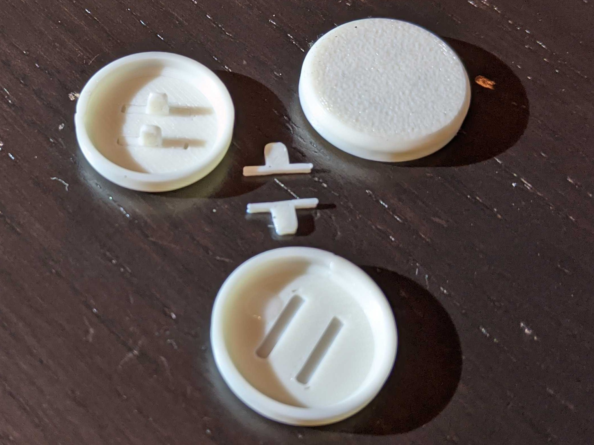

Flatbox Buttons
-----------------
Note, this is a modification of [Jfedor's Flatbox](https://github.com/jfedor2/flatbox).  All credit goes to him for making an awesome design.  

<table width=100%>
<TR>
<TD width=100% align="center"></TD>
</TR>
</TABLE>

**Why use these?**
- I frequently see single piece 3d printed button caps.  The issues with printing button caps as a single piece is that the legs are printed in a weak orientation and break off very easily.  
- This design separates the legs from the button caps so that the legs are now printed in the strongest orientation and are much less likely to break.  Once you glue the legs into the caps, they will feel very strong.

**Instructions**
- The legs should be able to fit into the slots into the button caps with no/very little sanding.
  - Depending on how well your printer prints to tolerance, you will need to print either the loose or tight tolerance pieces.  
- add a little bit of superglue into the slot on the cap then put the leg into the slot.  
