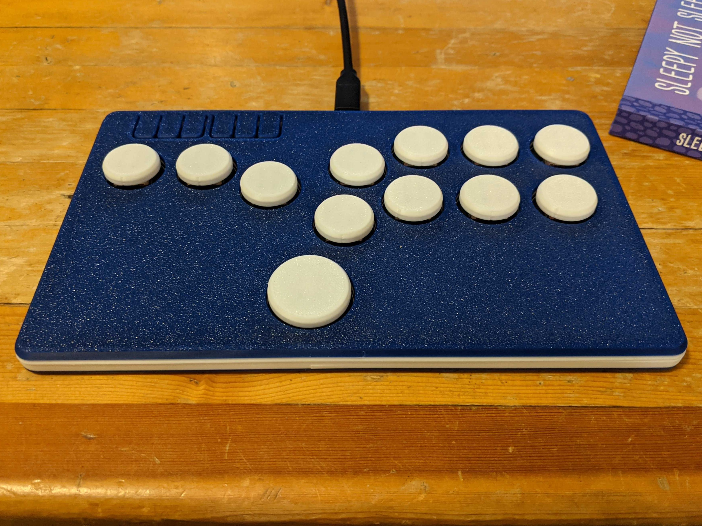
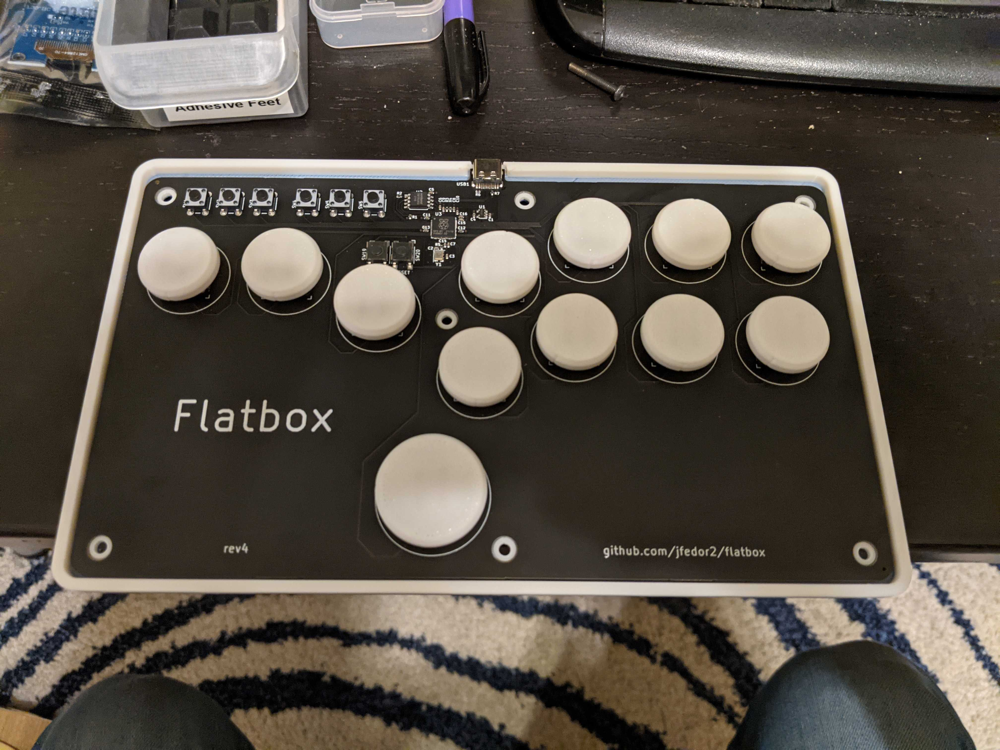
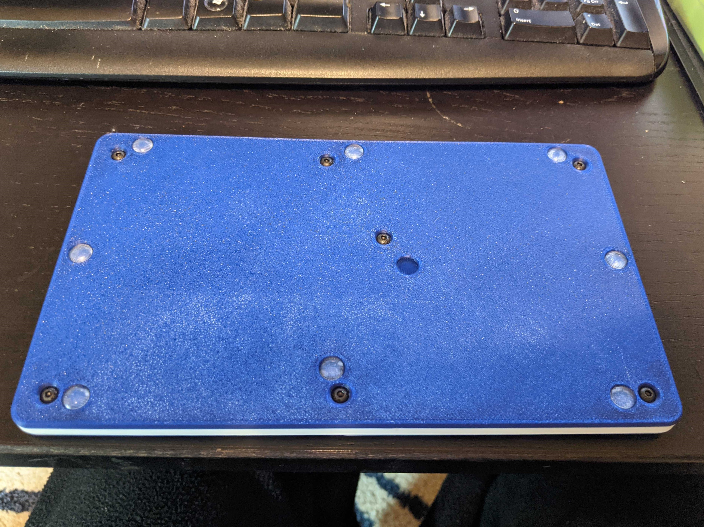

Flatbox Rev 4 Case
-----------------
Note, this is a modification of [Jfedor's Flatbox](https://github.com/jfedor2/flatbox), more specifically the [Rev 4 Case](https://github.com/jfedor2/flatbox/tree/master/hardware-rev4).  All credit goes to him for making an awesome design.  

<table width=100%>
<TR>
<TD width=33% align="center"></TD>
<TD width=33% align="center"></TD>
<TD width=33% align="center"></TD>
</TR>
</TABLE>

**BOM:**

 - 7 * m3 x D5mm x L4mm (5mm diameter, 4mm length) heatsets.
   - https://www.aliexpress.com/item/4000232858343.html
 - 8mm x 2.5mm rubber feet if desired
   - https://www.aliexpress.com/item/32764361927.html
 - 7 * m3x6mm button head cap screws
   - https://www.aliexpress.com/item/1005001943398161.html
     - This is an example, I ordered mine from bolt depot

**Instructions**
- the brass heatsets are melted into the lid holes.
- m3x6 button heads.  short button head screws are needed due to how thin the flatbox is.  
- as long as your printer can bridge short distances you shouldn't need to use supports.
- note the upper lid face flex button things were also reshaped to be less square.  This was just a personal preference.
