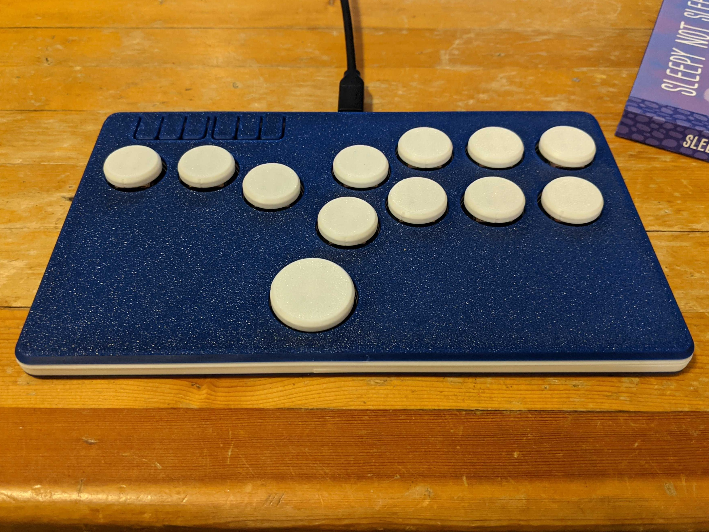
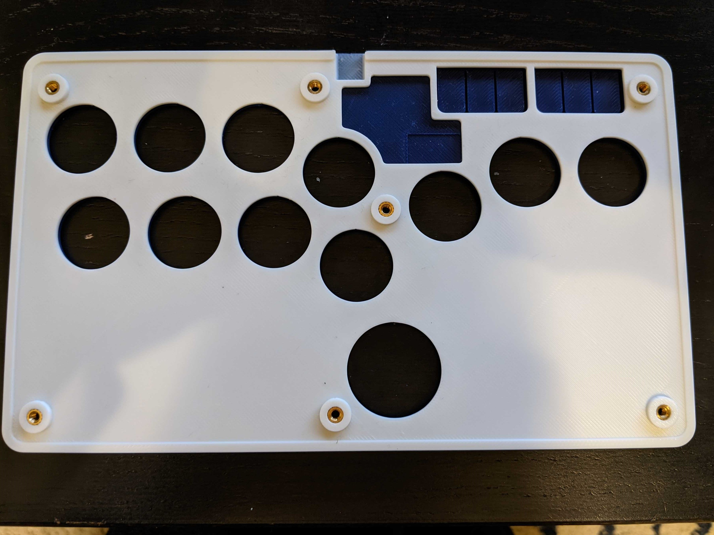

Long's Flatbox Mods
-----------------
Note, these are modifications of [Jfedor's Flatbox](https://github.com/jfedor2/flatbox).  All credit goes to him for making an awesome design.  

<table width=100%>
<TR>
<TD width=50% align="center"></TD>
<TD width=50% align="center"></TD>
</TR>
<TR>
<TD width=50% align="center"></TD>
<TD width=50% align="center"></TD>
</TR>
</TABLE>

 - [Buttons](Buttons/)
   - I frequently see 3d printed button caps posted online.  The issues with printing button caps as a single pice is that the legs are printed a very weak orientation and break off very easily.  
   - This design separates the legs from the button caps so that the legs are now printed in the strongest orientation and are much less likely to break.  Once you glue the legs into the caps, they will feel very strong.
 - [Case](Rev4Case/)
   - Case modified to use brass heatsets and m3 screws instead of wood screws.  I prefer using brass threaded heatsets instead of screwing into plastic if possible.
   - Also makes some small changes to the appearance of the face buttons.
