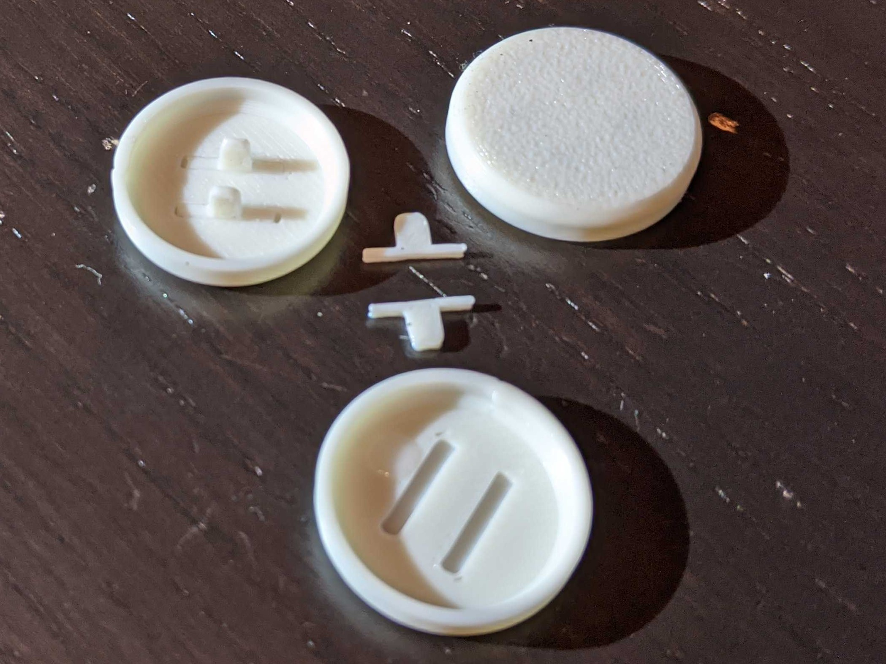

Long's Flatbox Mods
-----------------
Note, these are modifications of [Jfedor's Flatbox](https://github.com/jfedor2/flatbox).  All credit goes to him for making an awesome design.  

<table width=100%>
<TR>
<TD width=50% align="center"></TD>
<TD width=50% align="center"></TD>
</TR>
</TABLE>

 - Buttons
   - Buttons printed in two pieces that are stronger so the legs don't snap.
 - Case
   - Case modified to use brass heatsets and m3 screws instead of wood screws.  Also makes some small changes to the appearance of the face buttons.
